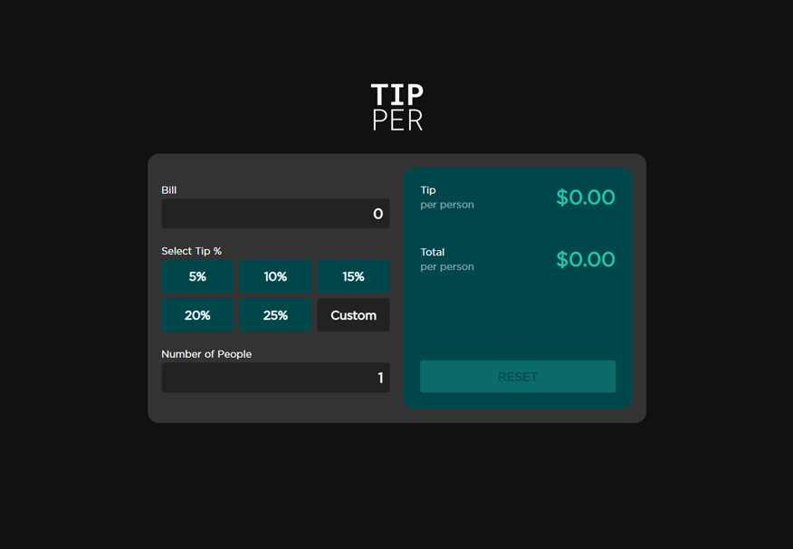

# Vanilla JS Tip Calculator 

[View Site](acegk.github.io/tip-calculator/)

A tip calculator that evaluates a tip based on the bill amount, chosen %, and # of people. Results display the tip-per-person and the total-per-person. 

 

# Frontend Mentor - Tip calculator app solution

This is a solution to the [Tip calculator app challenge on Frontend Mentor](https://www.frontendmentor.io/challenges/tip-calculator-app-ugJNGbJUX). Frontend Mentor challenges help you improve your coding skills by building realistic projects.

## Table of contents

- [Overview](#overview)
  - [The challenge](#the-challenge)
  - [Screenshot](#screenshot)
  - [Links](#links)
- [My process](#my-process)
  - [Built with](#built-with)
  - [Features](#features)
  - [To-do](#To-do)

## Overview

### The challenge

Users should be able to:

- View the optimal layout for the app depending on their device's screen size
- See hover states for all interactive elements on the page
- Calculate the correct tip and total cost of the bill per person

### Screenshot

### Links

- [View Site](acegk.github.io/tip-calculator/)

 

## My process

### Built with

- HTML5
- CSS
- JavaScript
- Flexbox
- CSS Grid

## Features 
* Simple math
* Custom tip %
* Reset button
* Active states
* USD formatting
* Light/Dark Modes (based on browser preference)

## To-do
* Error states
* Improve mobile styling
* Add icons to input fields
* better font
* dark/light mode toggle
